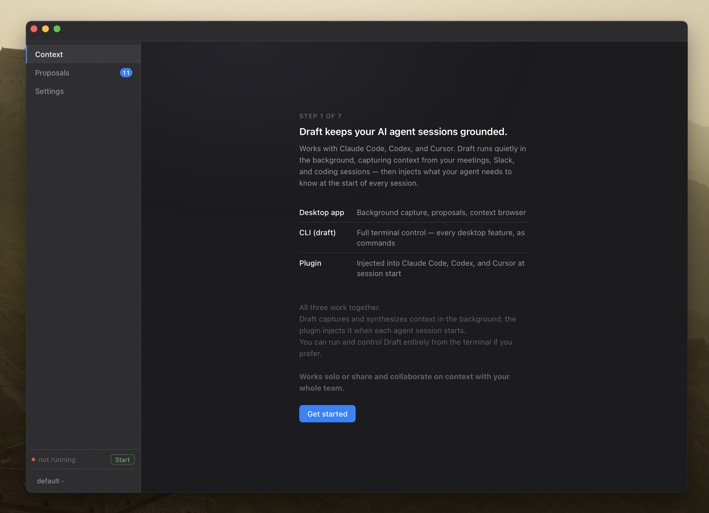

# Draft

Draft keeps your AI agent sessions grounded. It runs in the background, capturing context from your meetings, Slack, and GitHub activity, then injects what your agent needs to know at the start of every session — automatically.

> **Platform:** macOS on Apple Silicon. Intel Mac and Windows support is not available yet.



---

## How it works

```
Inputs (Granola, Slack, GitHub)
        |
        v
Background daemon — captures + synthesizes via Claude
        |
        v
Proposed updates land in your inbox (desktop app / CLI)
        |
        v  (you accept)
Workspace context: ~/.draft/workspaces/<profile>/context/
        |
        v
Plugin hook fires at every session start
        |
        v
Context injected into the agent's system prompt
```

The daemon is registered as a macOS LaunchAgent (`com.draft.daemon`). It starts at login and restarts automatically. All synthesis calls go through your own Claude subscription — Draft does not proxy them. Everything stays on your machine.

---

## Repo structure

```
draft/
├── cli/                  # Draft CLI (TypeScript, compiled to a binary via bun)
├── background/           # Background daemon (TypeScript + shell scripts)
│   ├── integrations/     # Pollers: Granola, Slack, GitHub
│   ├── synthesizers/     # Per-source synthesizers (session, Granola, Slack, GitHub)
│   └── draft-background.ts
├── core/                 # Shared library (workspace resolution, config, types)
├── desktop/              # macOS desktop app (Electrobun + React 19)
├── cli-agent-plugin/     # Plugin for Claude Code, Codex, Cursor (subtree), OpenClaw, Hermes
│   ├── hooks/            # inject-context.sh (session start), on-session-end.sh
│   ├── skills/           # /draft:setup, /draft:synthesize, /draft:publish, etc.
│   └── agents/           # OpenClaw + Hermes plugin adapters
├── landing-page-app/     # Marketing site (Next.js)
├── install.sh            # One-shot install script
└── Makefile              # CLI + desktop release automation
```

---

## Prerequisites

- **macOS** (Apple Silicon)
- **git** — to clone the repo
- **[Bun](https://bun.sh)** — runtime + package manager for all TypeScript workspaces
- **[tmux](https://github.com/tmux/tmux)** — used by the daemon to manage background processes
- **[Claude Code](https://claude.ai/code)** (or Codex / Cursor) — the agent the plugin hooks into
- **[gh CLI](https://cli.github.com)** — required for team collaboration features (`draft setup-collab`)

> **Note:** bun and tmux are bundled inside the macOS desktop app and extracted automatically at install time. If you're running from source (CLI only, no desktop app), install them manually:

```bash
curl -fsSL https://bun.sh/install | bash
brew install tmux
```

---

## Running from source

### 1. Clone and install

```bash
git clone https://github.com/idodekerobo/draft.git
cd draft
bash install.sh
```

`install.sh` does the following:
1. Verifies bun is installed
2. Installs TypeScript dependencies for the CLI workspace (`cli/`)
3. Copies the `draft` wrapper script to `~/bin/` (or `/usr/local/bin/`)
4. Installs shell tab completion (zsh or bash)
5. Runs `draft add claude-code` to wire the plugin and daemon into Claude Code

After install, run `draft --help` to verify everything is on PATH.

### 2. Initialize a workspace

```bash
draft init
```

This runs an interview to set up your first profile and writes context files to `~/.draft/workspaces/default/`.

### 3. Start the daemon

```bash
draft daemon start
```

Or let the LaunchAgent handle it — it starts automatically at login after `install.sh` runs.

---

## Development

This is a Bun monorepo. Install all workspace dependencies from the root:

```bash
bun install
```

### CLI

```bash
cd cli
bun run dev         # run directly with bun (no compile step)
bun run build       # compile to ../draft-bin binary
bun test            # run tests
```

The compiled binary is the `draft-bin` file at the repo root. The `draft` wrapper script in your PATH delegates to it.

### Background daemon

```bash
cd background
bun run background/draft-background.ts   # run daemon directly
```

The daemon reads from `~/.draft/` and writes proposals to `~/.draft/workspaces/<profile>/proposals/`. Logs go to `~/.draft/background/logs/`.

### Desktop app

The desktop app is built with [Electrobun](https://electrobun.dev) — a Bun-native desktop framework. The main process runs in Bun; views are webviews backed by React 19.

```bash
cd desktop
bun run dev         # dev mode with hot reload
bun run start       # dev mode without watch
```

For a local build (no signing or notarization):

```bash
bun run build:dev
```

Production builds use `make desktop-release v=<version>` from the repo root. This requires Apple Developer credentials for signing and notarization.

### Plugin (cli-agent-plugin)

The plugin is a git subtree at `cli-agent-plugin/` — the public-facing repo is at `idodekerobo/draft-cli-plugin`. Changes should always be made in the monorepo and pushed to the plugin repo via Make:

```bash
make cli-push                  # sync to plugin repo (development)
make cli-release v=1.2.0 m="release notes"   # cut a versioned release
```

The plugin hooks are shell scripts. `inject-context.sh` runs at session start and writes context into the agent's system prompt. `on-session-end.sh` queues a synthesis job for the daemon.

---

## Context files

All workspace state lives under `~/.draft/`:

| Path | Contents |
|------|----------|
| `~/.draft/workspaces/<profile>/context/` | Accepted context files (company, product, priorities, etc.) |
| `~/.draft/workspaces/<profile>/proposals/` | Pending proposed updates |
| `~/.draft/personal/memory.md` | Global personal memory (shared across all profiles) |
| `~/.draft/config.json` | Global config (active profile, integration credentials) |
| `~/.draft/background/` | Daemon binary, start/stop scripts |
| `~/.draft/background/logs/` | Daemon logs |
| `~/.draft/bin/draft` | CLI binary (symlinked to `/usr/local/bin/draft`) |

---

## Integrations

Connect data sources with `draft connect` or `draft add <source>`:

- **Granola** — meeting notes (MCP or API)
- **Slack** — threads and channel activity
- **GitHub** — PR activity, commits, issues

The daemon polls each source on a schedule, synthesizes new information via Claude, and stages proposed context updates for your review.

---

## Team collaboration

Draft can sync context through a GitHub repository you control. One person acts as the curator and publishes; teammates pull updates.

```bash
draft setup-collab     # configure the shared repo (run once)
draft publish          # push accepted context to the shared repo
draft load-team        # pull latest team context locally
```

This uses your local `gh` credentials and the separate-clone pattern — the Draft workspace (`~/.draft/`) is never initialized as a git repo.

---

## Key CLI commands

```bash
draft --help                  # full command reference
draft init                    # set up a new workspace
draft status                  # show daemon status + active profile
draft proposals               # review pending proposals
draft publish                 # accept + push context to team repo
draft profiles                # list profiles
draft switch <profile>        # activate a named profile
draft add <tool>              # install plugin into claude-code | codex | cursor
draft daemon start|stop       # control the background daemon
draft connect                 # configure integrations
```

---

## Release workflow

**CLI plugin:**
```bash
# from main, after merging your branch
make cli-release v=1.3.0 m="what changed"
```

**Desktop app:**
```bash
# from main, requires Apple Developer credentials
make desktop-release v=1.0.0

# canary build (any branch)
make desktop-release v=1.0.0 canary=1
```

---

## Docs

- [What is Draft](./docs/overview.md)
- [Architecture](./docs/architecture.md)
- [How context injection works](./docs/how-context-injection-works.md)
- [How proposals work](./docs/proposals.md)
- [Setting up collaboration](./docs/setting-up-collaboration.md)
- [Privacy](./docs/privacy.md)
